# Sessionale Portfolio Theme

A minimal WordPress theme for artists and creatives migrating from Adobe Portfolio. Features a one-click import wizard that automatically transfers your projects, images, and videos to a self-hosted WordPress site.

## Features

- Portfolio post type with custom gallery system
- Adobe Portfolio import wizard (auto-detects projects, images, videos)
- Responsive grid layout with hover overlays
- Dark/light theme toggle
- Mobile-friendly navigation
- Contact form with Google reCAPTCHA v3 support

## Getting Started

1. Activate the theme in WordPress
2. Go to **Sessionale** in the admin menu
3. Enter your details and Adobe Portfolio URL(s)
4. Click **Save Settings & Start Import**

The import automatically downloads high-quality images, detects duplicates, and sets up your portfolio pages.

## How to Use (Step-by-Step)

This walkthrough shows how to manage your portfolio after the theme is installed. Every step has a screenshot below it.

### Logging in

Open your browser and go to your website address followed by `/wp-admin` — for example `https://your-domain.com/wp-admin` (replace `your-domain.com` with your own site address). Enter your username/email and password, then click **Log In**.

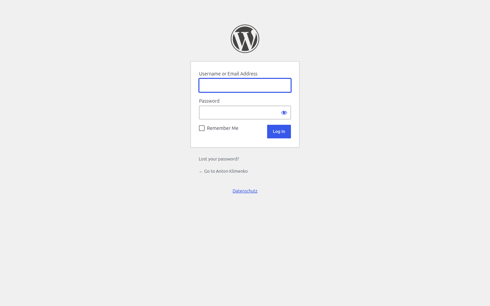

### Finding your way around the admin

All portfolio management lives under the **Portfolio** menu in the left sidebar: **All Projects** (everything you've created), **Add New Project**, and **Categories**.

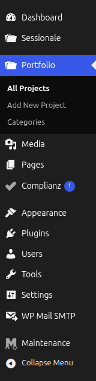

To edit a project you already made, open **Portfolio → All Projects** and click its title to open its edit page.

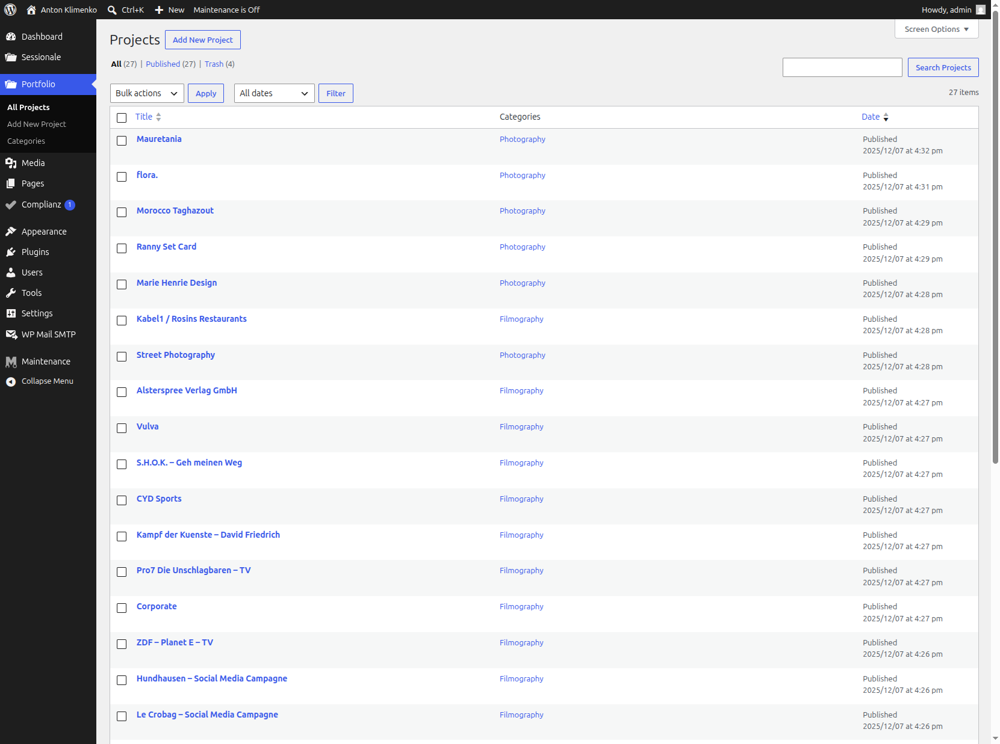

### 1. Create a portfolio item (Project)

In the left admin menu, go to **Portfolio → Add New Project**. Give the project a title.

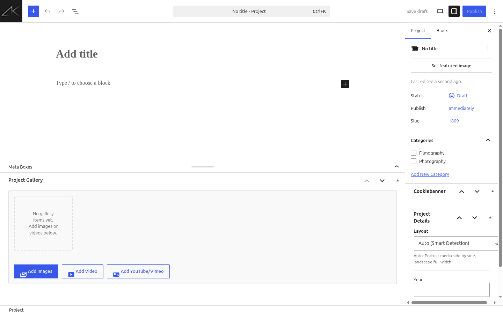

### 2. Upload images to the gallery

In the **Project Gallery** box, click **Add Images**. Upload new files or pick existing ones from the Media Library, then choose **Add to Gallery**.

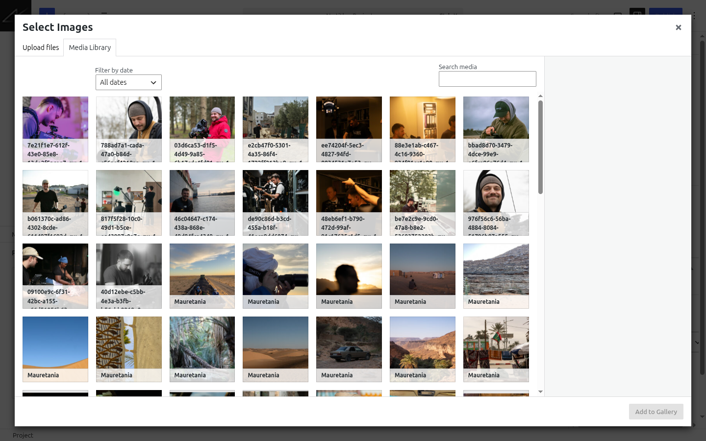

### 3. Add a video or YouTube/Vimeo embed

In the same box, use **Add Video** to add an uploaded video file, or **Add YouTube/Vimeo** to paste a video link.

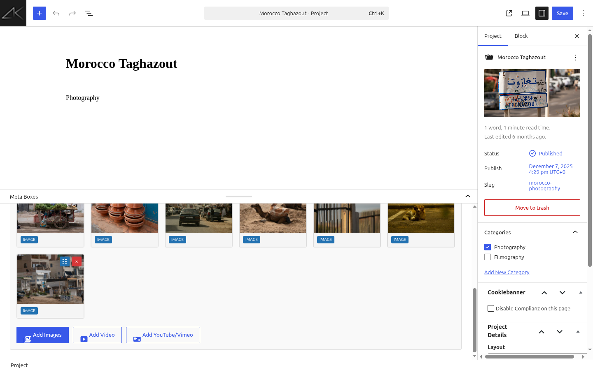

### 4. Set per-item layout widths

Click the layout button (⛭) on any gallery item to choose its width — **Full (100%)**, **2/3**, **1/2**, **1/3**, and so on. Leave it on **Auto** to let the theme decide.

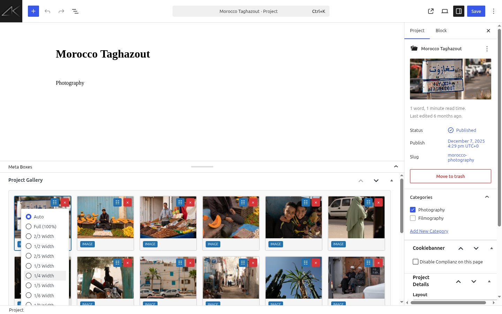

### 5. Reorder gallery items by dragging

Drag any gallery item by its handle (✥) to change the order images and videos appear inside the project.

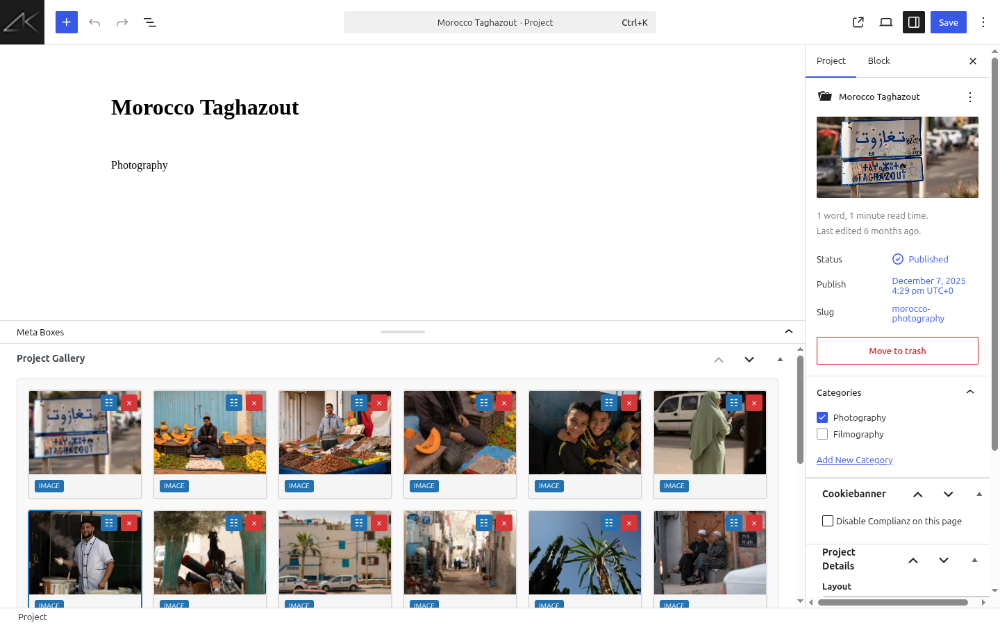

### 6. Set project details

In the **Project Details** panel, set the **Layout** (Auto / Full Width / Grid), **Year**, and **Client**.

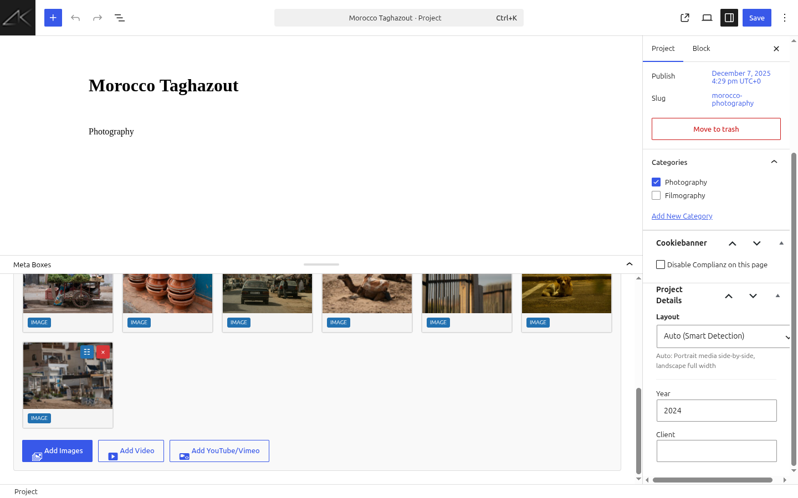

### 7. Assign a portfolio category

In the **Categories** panel, tick the category this project belongs to (for example *Photography*), or use **Add New Category**. Then click **Publish** (or **Update**) to save the project.

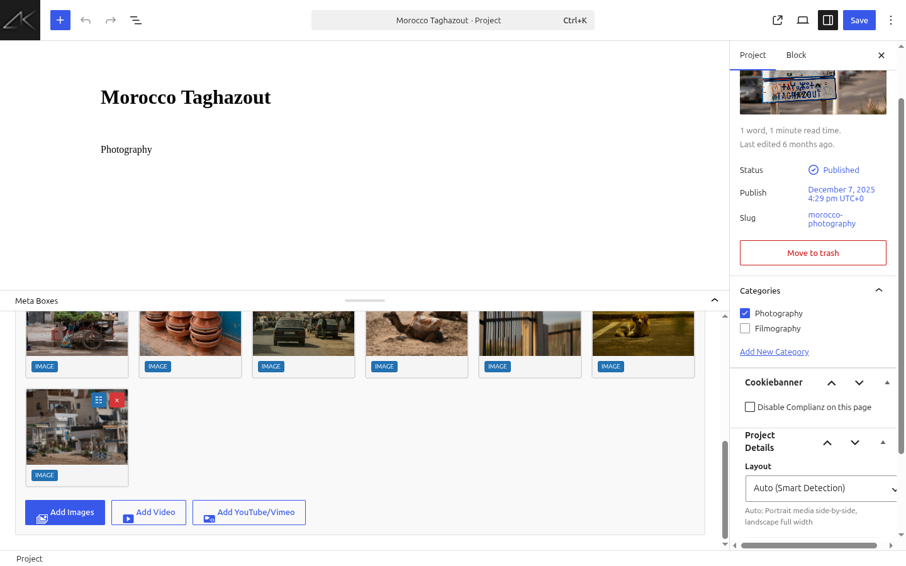

### 8. Place a portfolio on a page with the shortcode

Go to **Pages** in the left sidebar and open the page that should display your portfolio (for example *Photography*), or add a new one with **Add Page**.

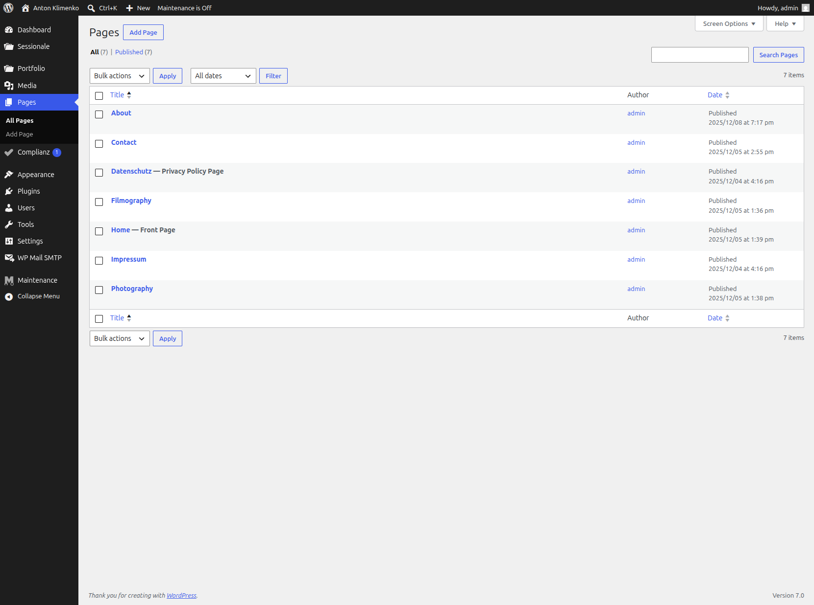

In the page, add a **Shortcode** block and enter the portfolio shortcode:

```
[sessionale_portfolio category="photography"]
```

Optional attributes: `columns="3"` (number of columns) and `limit="-1"` (max projects, `-1` = all).

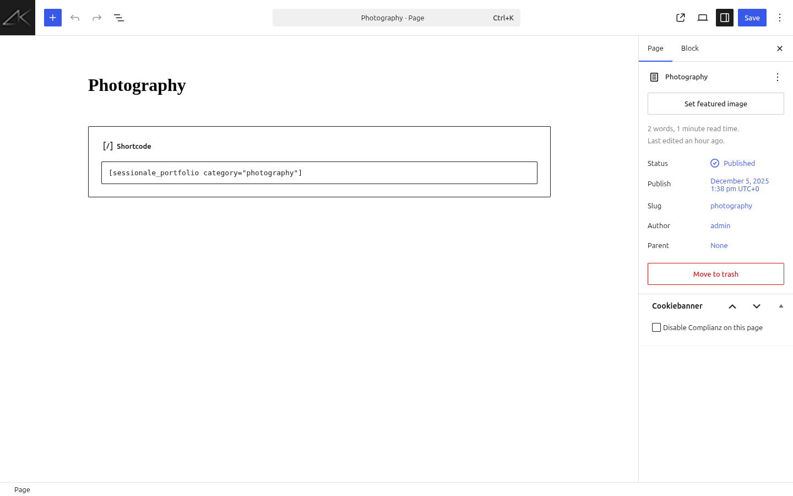

### 9. Change the order projects appear on the page

On that same page, scroll to the **Portfolio Order** box. Drag the projects into the order you want them shown. New projects added to the category later appear at the end until you reorder them. Click **Update** to save.

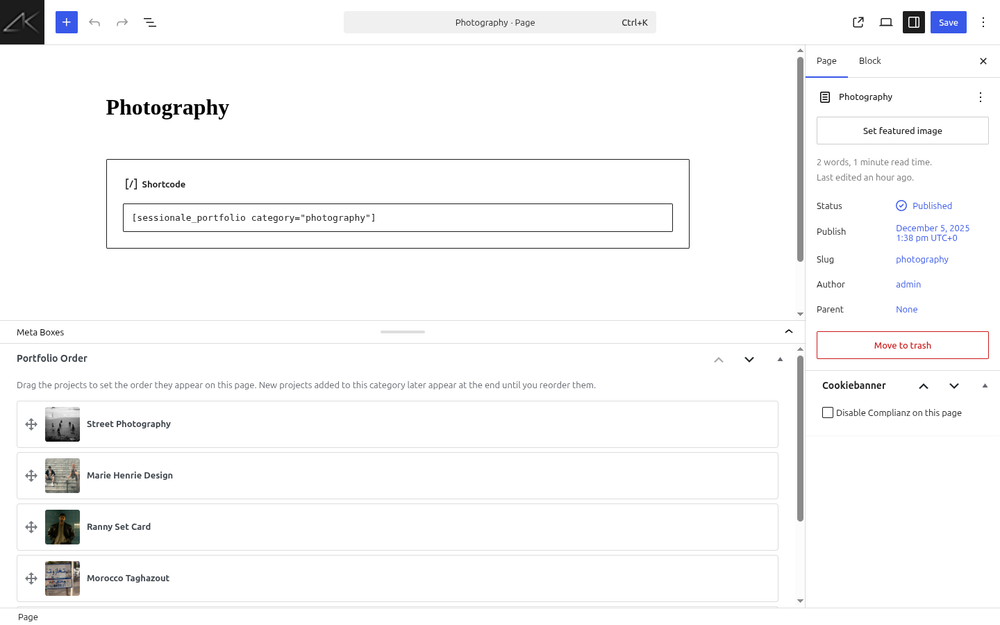

### 10. View the new order on the live page

Open the page on your live site to confirm the projects now appear in your chosen order.

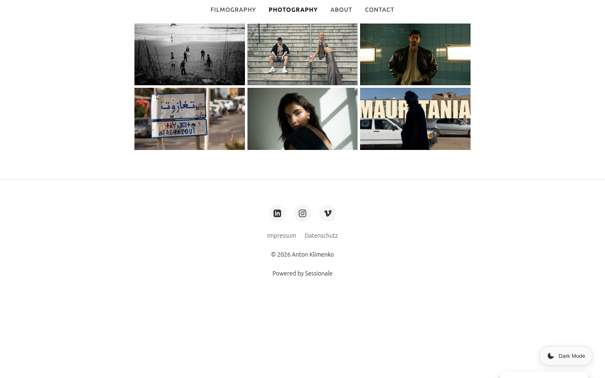

## Contact Form Email Setup

Emails are sent from `noreply@yourdomain.com` by default (or the address you configure in Sessionale settings).

The "From" address must exist as a valid mailbox on your server. If emails land in spam, consider using the **WP Mail SMTP** plugin to route emails through your SMTP server.

## Server Requirements

The import downloads many images. Recommended PHP settings:

| Setting | Recommended |
|---------|-------------|
| `max_execution_time` | `300` |
| `memory_limit` | `256M` |
| `post_max_size` | `64M` |
| `upload_max_filesize` | `32M` |

## Troubleshooting

**Import fails or times out:** Increase `max_execution_time` and `memory_limit`, check WordPress debug log.

**Images are low quality:** Run the import again (it upgrades existing images).

**Emails not arriving:** Ensure the "From" mailbox exists, check spam folder, use WP Mail SMTP plugin.

## Recommended Plugins

After activation, you'll see a notice recommending:
- **Complianz** – Cookie consent for GDPR/CCPA compliance
- **OMGF** – Hosts Google Fonts locally for GDPR compliance

These are optional but recommended for EU compliance.

## Legal Compliance (Germany)

For German users requiring DSGVO-compliant legal texts (Impressum, Datenschutzerklärung), consider the [IT-Recht Kanzlei AGB Starterpaket](https://www.it-recht-kanzlei.de/agb-starterpaket.php?partner_id=1380).
